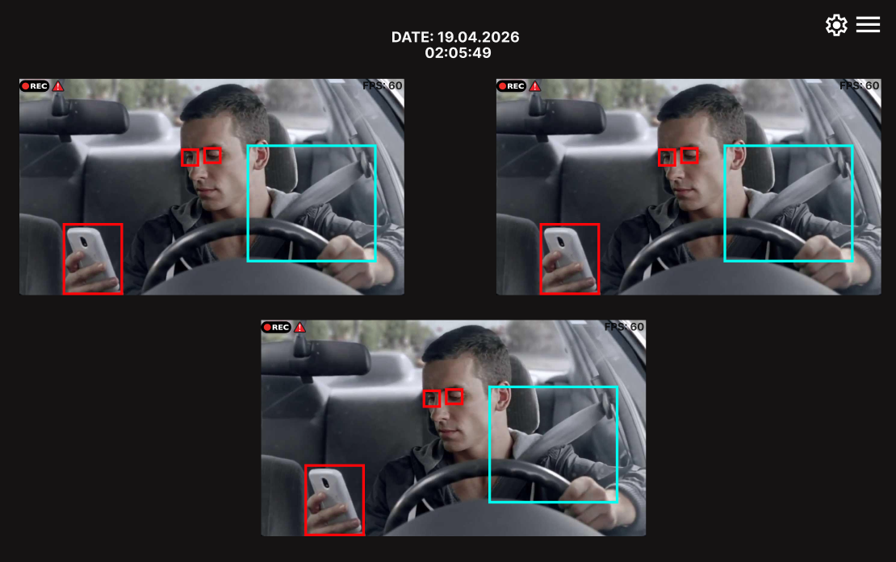
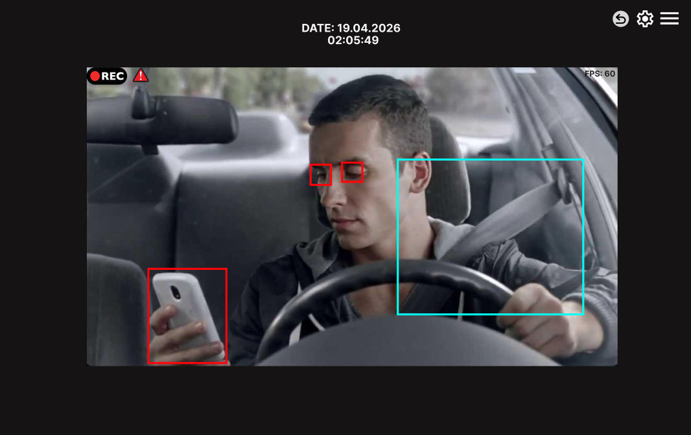
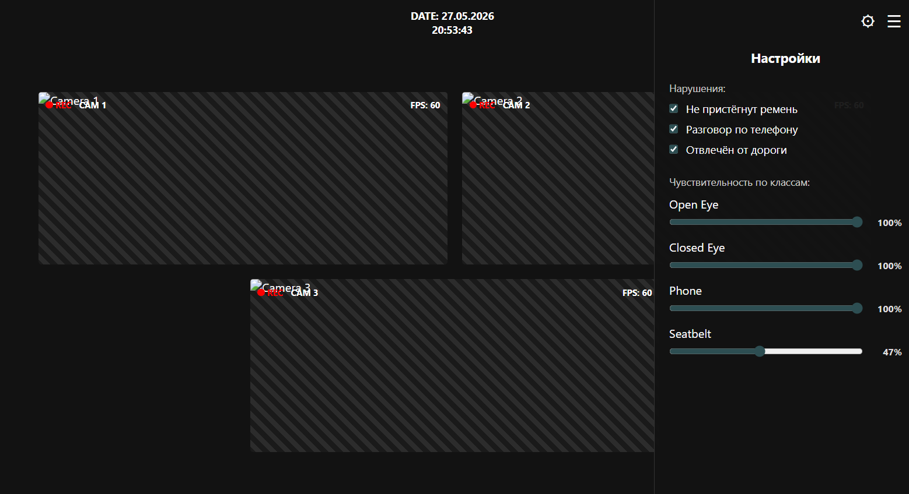
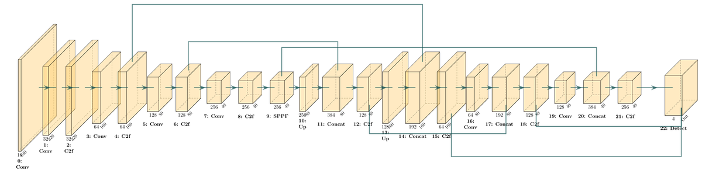
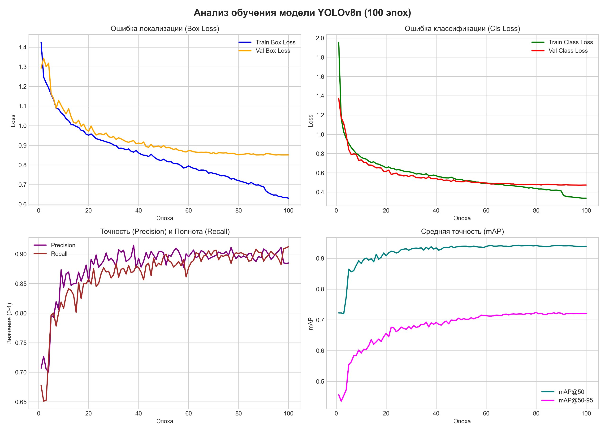
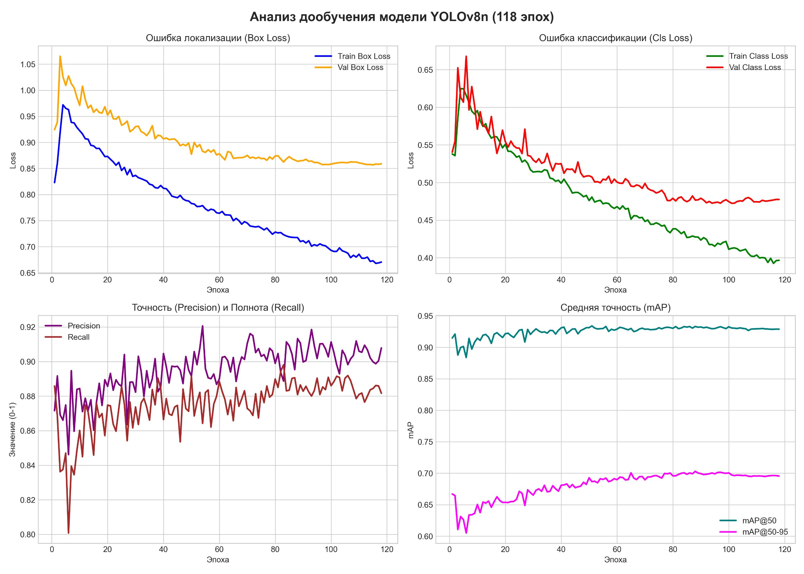
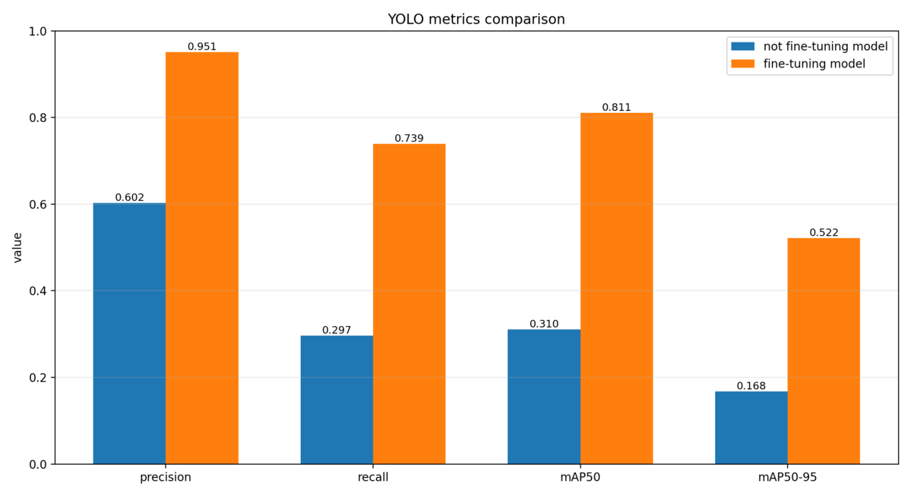
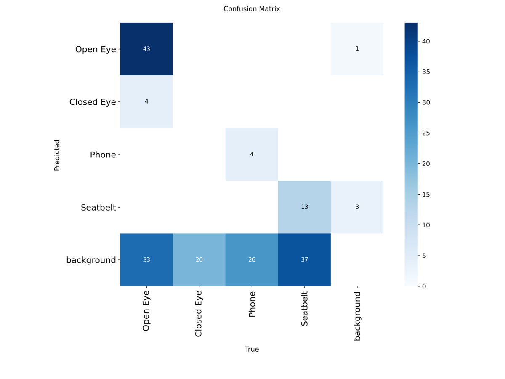
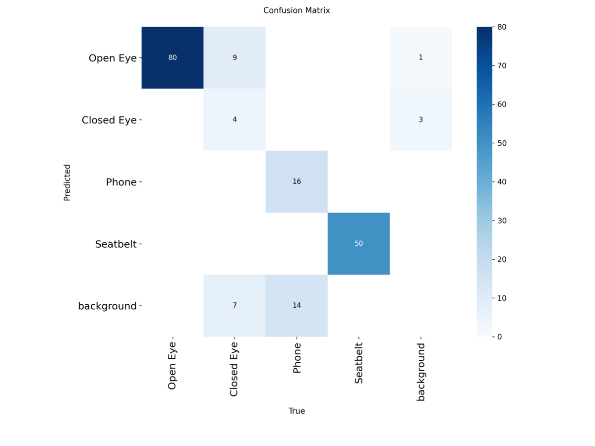

# Система видеоаналитики для детекции водителей-нарушителей

## Описание проекта

**Система видеоаналитики для детекции водителей-нарушителей** — это desktop-приложение для анализа видеопотока из кабины автомобиля в режиме, близком к реальному времени.

Система получает изображение с одной или нескольких камер, выполняет детекцию признаков нарушений с помощью нейронной сети YOLOv8n, отображает результат в пользовательском интерфейсе и сохраняет зафиксированные нарушения в локальное хранилище.

Проект разрабатывался в рамках командной разработки по требованиям заказчика. Основная задача системы — автоматически выявлять потенциально опасные ситуации, связанные с поведением водителя, и сохранять доказательную информацию о нарушениях.

## Кратко

- Desktop-приложение для мониторинга водителя по видеопотоку из кабины автомобиля.
- YOLOv8n используется для детекции глаз, телефона и ремня безопасности.
- Модель была дообучена на данных из рабочей среды системы.
- Качество модели после дообучения улучшилось: mAP\@50 вырос с 0.310 до 0.811.
- Система сохраняет нарушения с датой, типом события и фото-доказательством.
- В интерфейсе доступны просмотр камер, история нарушений и настройка чувствительности детекции.

## Детектируемые события

Система ориентирована на фиксацию следующих нарушений:

- отсутствие ремня безопасности;
- использование телефона во время движения;
- признаки сонливости водителя по закрытым глазам;

В текущей ML-модели используются следующие классы детекции:

| Класс        | Описание            |
| ------------ | ------------------- |
| `Open Eye`   | открытый глаз       |
| `Closed Eye` | закрытый глаз       |
| `Phone`      | телефон             |
| `Seatbelt`   | ремень безопасности |

## Основные возможности

- обработка видеопотока с камеры в реальном времени;
- поддержка одной или нескольких камер;
- работа с локальной web-камерой и потенциальная поддержка IP-камер через RTSP/HTTP-потоки;
- детекция объектов с помощью YOLOv8n;
- настройка чувствительности детекции по отдельным классам;
- включение и отключение отдельных типов нарушений;
- отображение bounding boxes поверх видеопотока;
- визуальное предупреждение о нарушениях в интерфейсе;
- сохранение события нарушения с датой, временем, типом нарушения и фото-доказательством;
- просмотр истории нарушений через интерфейс;
- удаление отдельных записей или очистка всей истории нарушений;
- локальное хранение данных без обязательного подключения к интернету.

## Демонстрация интерфейса

## Демонстрация интерфейса


Ниже показаны основные экраны приложения: просмотр видеопотока с камер, отображение детекций, история зафиксированных нарушений и настройки системы.


### Главный экран


На главном экране отображаются видеопотоки с камер, результаты детекции и предупреждения о нарушениях.





### История нарушений


В истории отображаются зафиксированные события: дата и время нарушения, камера, тип нарушения и фото-доказательство.





### Настройки системы


В настройках можно включать и отключать отдельные типы нарушений, а также изменять чувствительность детекции по классам.





## Архитектура системы

Проект состоит из нескольких основных частей:

1. **Модуль работы с камерами**\
   Отдельные потоки получают кадры с камер и передают их в очередь обработки.

2. **ML-модуль детекции**\
   YOLOv8n выполняет детекцию объектов на каждом кадре.

3. **Модуль правил нарушений**\
   Поверх детекций применяется логика временных порогов: например, нарушение фиксируется не по одному кадру, а после устойчивого наличия признака в течение заданного времени.

4. **Модуль логирования**\
   При нарушении сохраняется запись события и изображение-доказательство.

5. **Пользовательский интерфейс**\
   Интерфейс реализован на HTML/CSS/JavaScript и запускается как desktop-приложение через PyWebView.

## Логика фиксации нарушений

Примеры правил:

- если телефон детектируется дольше заданного времени — фиксируется `phone_usage`;
- если обнаружены два закрытых глаза в течение заданного времени — фиксируется `drowsiness`;
- если ремень отсутствует после подтверждённого состояния — фиксируется нарушение, связанное с отсутствием или снятием ремня.

Такой подход снижает количество ложных срабатываний и делает систему устойчивее к кратковременным ошибкам детекции.

## ML-модель

В качестве модели компьютерного зрения используется **YOLOv8n**.

YOLOv8n была выбрана как базовая архитектура, потому что:

- подходит для задач object detection;
- имеет облегчённую архитектуру;
- может работать достаточно быстро для обработки видеопотока;
- позволяет находить несколько объектов разных классов на одном кадре;
- может быть дообучена на собственных данных под конкретную среду.

### Датасет

В качестве основы использовался открытый датасет [**DMS Driver Monitoring System**](https://www.kaggle.com/datasets/habbas11/dms-driver-monitoring-system).

Из исходного датасета был удалён класс `Cigarette`, так как детекция сигарет не входила в итоговые требования проекта.

### Первичное обучение

Первичная модель была обучена на датасете из **5489 изображений** в течение **100 эпох**.

Размер входного изображения:

```text
imgsz = 640
```

Распределение объектов по классам в обучающей выборке:

| Класс      | Количество объектов |
| ---------- | ------------------- |
| Open Eye   | 7363                |
| Closed Eye | 1633                |
| Phone      | 1724                |
| Seatbelt   | 2212                |

Размеры выборок:

| Выборка       | Количество изображений |
| ------------- | ---------------------- |
| Обучающая     | 5489                   |
| Валидационная | 2158                   |
| Тестовая      | 905                    |

### Дообучение модели

После первичного обучения модель была дообучена на изображениях, собранных в условиях, близких к целевой среде работы системы.

Для дообучения было собрано **60 дополнительных изображений**. Чтобы усилить влияние этих данных и повысить устойчивость модели к неидеальному качеству входного видеопотока, использовалась аугментация через **Gaussian Blur**.

В результате 60 новых изображений были расширены до **600 изображений**.

После добавления собственных данных обучающая выборка увеличилась с **5489** до **6089 изображений**. Дообучение проводилось в течение **118 эпох**.

Распределение объектов по классам после расширения обучающей выборки:

| Класс      | Количество объектов |
| ---------- | ------------------- |
| Open Eye   | 8335                |
| Closed Eye | 1861                |
| Phone      | 2084                |
| Seatbelt   | 2812                |

Размеры выборок после добавления собственных данных:

| Выборка       | Количество изображений |
| ------------- | ---------------------- |
| Обучающая     | 6089                   |
| Валидационная | 2258                   |
| Тестовая      | 1005                   |

## Результаты модели

Для оценки качества сравнивались две модели:

- **not fine-tuning model** — модель до дообучения;
- **fine-tuning model** — модель после дообучения на собственных изображениях.

Сравнение проводилось на собранном нами тестовом наборе данных из рабочей среды, то есть в условиях, близких к тем, где должна использоваться итоговая система. Для обеих моделей использовались одинаковые изображения и одинаковые параметры инференса.

| Метрика    | До дообучения | После дообучения | Изменение |
| ---------- | ------------- | ---------------- | --------- |
| Precision  | 0.602         | 0.951            | +0.349    |
| Recall     | 0.297         | 0.739            | +0.442    |
| mAP\@50    | 0.310         | 0.811            | +0.501    |
| mAP\@50-95 | 0.168         | 0.522            | +0.354    |

Дообучение значительно улучшило качество модели на изображениях, близких к реальной среде использования системы. Особенно заметно выросли полнота детекции и mAP, что говорит о более уверенном обнаружении целевых объектов.

### Графики и матрицы ошибок













## Установка и запуск

### 1. Клонирование репозитория

```bash
git clone https://github.com/leriuszxc/driver-violation-detector.git
cd driver-violation-detector
```

### 2. Создание виртуального окружения

```bash
python -m venv .venv
```

Активация окружения на Windows:

```bash
.venv\Scripts\activate
```

Активация окружения на Linux/macOS:

```bash
source .venv/bin/activate
```

### 3. Установка зависимостей

```bash
pip install -r requirements.txt
```

### 4. Добавление весов модели

Веса модели включены в репозиторий.

Поместите файл весов в папку:

```text
models/
```

Рекомендуемое имя файла:

```text
models/driver_violation_yolov8n.pt
```

Если в коде используется другое имя модели, укажите путь в `config.py`.

Пример настройки:

```python
MODEL_PATH = BASE_DIR / "models" / "driver_violation_yolov8n.pt"
```

### 5. Запуск приложения

```bash
python app.py
```

После запуска откроется desktop-интерфейс системы мониторинга водителя.

## Конфигурация

Основные параметры проекта находятся в `config.py`.

Примеры параметров:

```python
CAMERA_SOURCES = {
    0: 0,
}

IMG_SIZE = 640
CONF_THRESHOLD = 0.15
IOU_THRESHOLD = 0.45

PHONE_SECONDS_THRESHOLD = 2.0
DROWSY_SECONDS_THRESHOLD = 1.5
NO_SEATBELT_SECONDS_THRESHOLD = 3.0
SEATBELT_ON_SECONDS_THRESHOLD = 1.0
```

### Камеры

Для локальной web-камеры можно использовать числовой индекс:

```python
CAMERA_SOURCES = {
    0: 0,
}
```

Для IP-камер можно использовать RTSP/HTTP-ссылки:

```python
CAMERA_SOURCES = {
    0: "rtsp://login:password@ip:port/stream1",
    1: "rtsp://login:password@ip:port/stream2",
}
```

## Структура проекта

```text
.
├── app.py                  # основной запуск приложения и цикл инференса
├── camera_worker.py        # потоковое чтение кадров с камер
├── config.py               # конфигурация проекта
├── detector.py             # обёртка над YOLOv8n
├── interface.html          # пользовательский интерфейс
├── logger_utils.py         # сохранение событий и фото-доказательств
├── rules.py                # логика фиксации нарушений
├── requirements.txt        # зависимости проекта
├── models/                 # веса модели
├── logs/                   # журналы и история нарушений
└── output/                 # дополнительные выходные файлы
```

## Команда и вклад участников

Проект выполнялся командой. Ниже указаны основные зоны ответственности участников.

| Участник                                                | Вклад                                                                                                                                                                                                                                                                                                                               |
| ------------------------------------------------------- | ----------------------------------------------------------------------------------------------------------------------------------------------------------------------------------------------------------------------------------------------------------------------------------------------------------------------------------- |
| [leriuszxc](https://github.com/leriuszxc)               | управление командой и коммуникация с заказчиком; анализ требований и принятие архитектурных решений; ML/CV: фильтрация DMS, сбор данных для дообучения, обучение и fine-tuning YOLOv8n, тестирование модели на данных из рабочей среды, анализ Precision/Recall/mAP и confusion matrix; участие в интеграции модели и документация. |
| [kartofelfyp](https://github.com/kartofelfyp)           | документация, backend, реализация UI в приложении, помощь в создании дополнительного набора данных для дообучения модели                                                                                                                                                                                                            |
| [I-Dmitriy-I](https://github.com/I-Dmitriy-I)           | документация, backend, помощь в создании дополнительного набора данных для дообучения модели                                                                                                                                                                                                                                        |
| [Vegas325657](https://github.com/Vegas325657)           | документация, UI-дизайн итоговой реализации системы                                                                                                                                                                                                                                                                                 |
| [lehaprofessional](https://github.com/lehaprofessional) | документация, создание первого рабочего прототипа приложения, настройка первичной логики фиксации нарушений                                                                                                                                                                                                                         |
| [bogdan](https://github.com/bogdan)                     | документация, помощь в создании дополнительного набора данных, разметка новых данных для дообучения, реализация UI системы                                                                                                                                                                                                          |

Под реализацией UI в проекте подразумевается не только визуальный дизайн, но и создание рабочей пользовательской части системы: просмотр истории нарушений, переключение между камерами, отображение видеопотока, отображение детекций и взаимодействие с сохранёнными событиями.

## Ограничения

Точность работы системы зависит от условий эксплуатации:

- качества и расположения камеры;
- освещения лица и корпуса водителя;
- ракурса камеры;
- степени размытия изображения;
- перекрытия лица, ремня или телефона посторонними объектами;
- качества входного видеопотока.

Система лучше работает, когда лицо водителя хорошо видно и достаточно освещено.

## Предупреждение

Проект является демонстрационной системой видеоаналитики и не должен использоваться как единственный источник принятия решений в реальных системах безопасности.

Результаты детекции могут содержать ложные срабатывания или пропуски, поэтому в практическом применении система должна проходить дополнительное тестирование, валидацию и настройку под конкретные условия эксплуатации.

## Возможные улучшения

- добавить автоматическое ограничение объёма локального хранилища;
- добавить экспорт истории нарушений;
- улучшить обработку нескольких камер;
- добавить авторизацию пользователей;
- добавить отдельный режим просмотра статистики нарушений;
- расширить датасет новыми условиями освещения и ракурсами;
- провести дополнительную оптимизацию модели для слабых вычислительных устройств;
- добавить Docker-конфигурацию для более удобного развёртывания.

